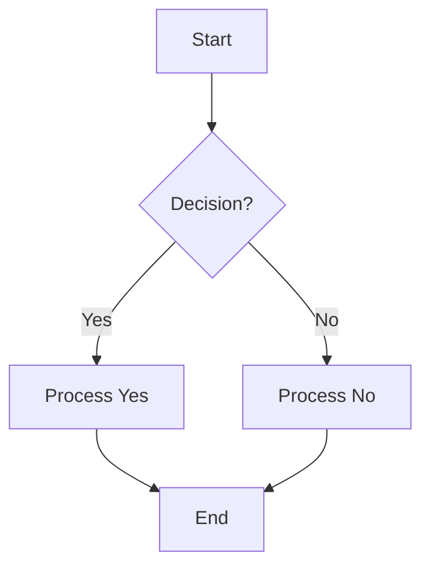

# Gemini API Usage Report - Key Metrics

## Paid Tier Generate Content Input Tokens (Per Minute)

| Date (UTC)            | Tokens Used | Limit        | Status     |
| :-------------------- | :---------- | :----------- | :--------- |
| 2026-02-26 23:47:41   | 884,559     | 1,000,000    | Within Limit |
| **2026-02-26 23:48:41** | **1,132,590** | **1,000,000**| **EXCEEDED** |
| 2026-02-26 23:49:41   | 371,659     | 1,000,000    | Within Limit |
| 2026-02-27 02:28:41   | 344,879     | 1,000,000    | Within Limit |
| 2026-02-27 02:29:41   | 290,216     | 1,000,000    | Within Limit |
| 2026-02-27 03:02:41   | 225,610     | 1,000,000    | Within Limit |

## Example Mermaid Diagram

