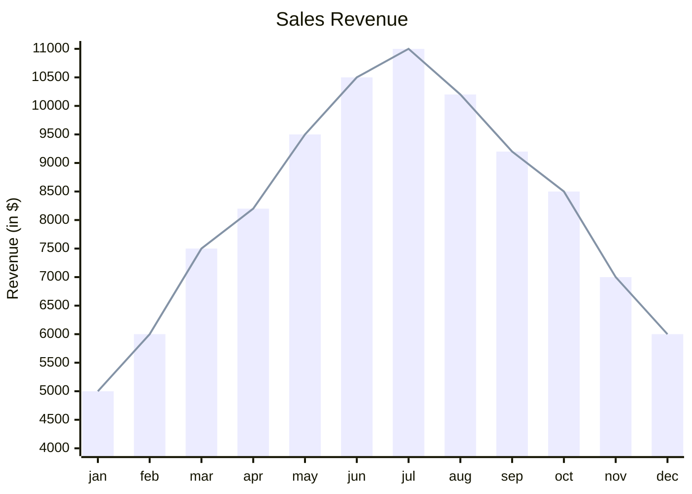

# Gemini LLM Usage Report - 2026-02-27

## Daily Overview

This report provides an overview of the Gemini LLM API usage for the Gorman Technology project, as of 2026-02-27.

## Usage Data Summary

| Metric                                       | Value       | Date       |
| :------------------------------------------- | :---------- | :--------- |
| Paid Tier Generate Content Input Tokens      | 55,731,612  | 2026-02-26 |
| Total API Requests (2026-02-27 UTC, partial) | 132         | 2026-02-27 |
| Total API Requests (2026-02-26 UTC)        | 258         | 2026-02-26 |

**Note:**
*   No data was available for "Free Tier Generate Content Input Tokens" or "Free Tier Generate Content Requests".
*   An error occurred when fetching "Paid Tier Generate Content Requests": `5 NOT_FOUND: Cannot find metric(s) that match type = "generativelanguage.googleapis.com/quota/generate_content_paid_tier_requests/usage".` This may indicate the metric is new or temporarily unavailable.

## Hourly API Requests (Last 24 Hours)

