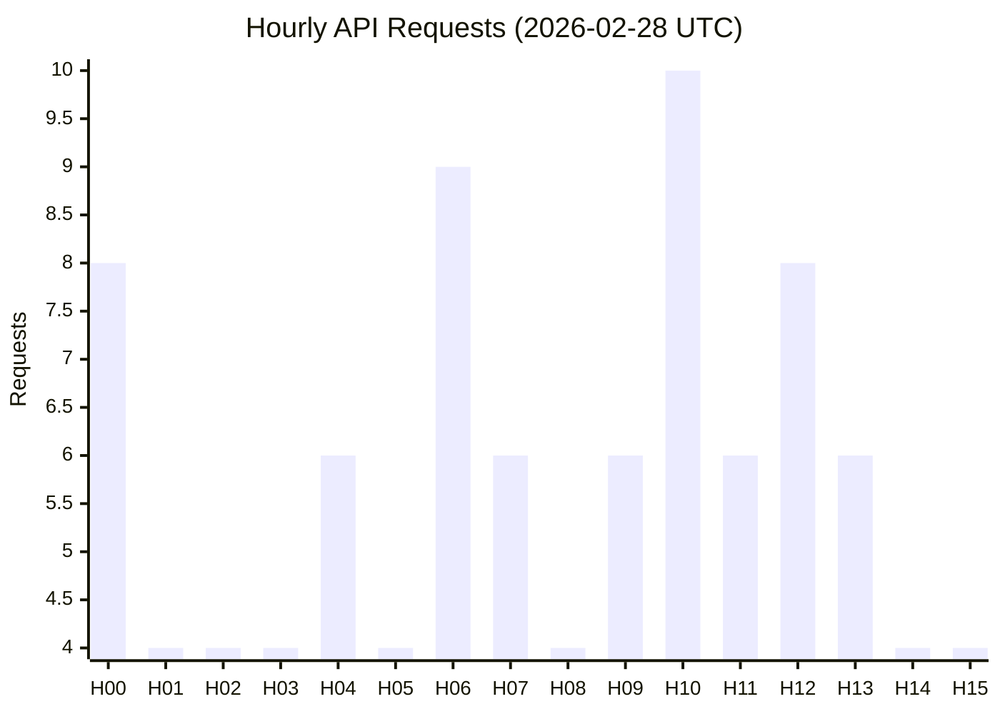
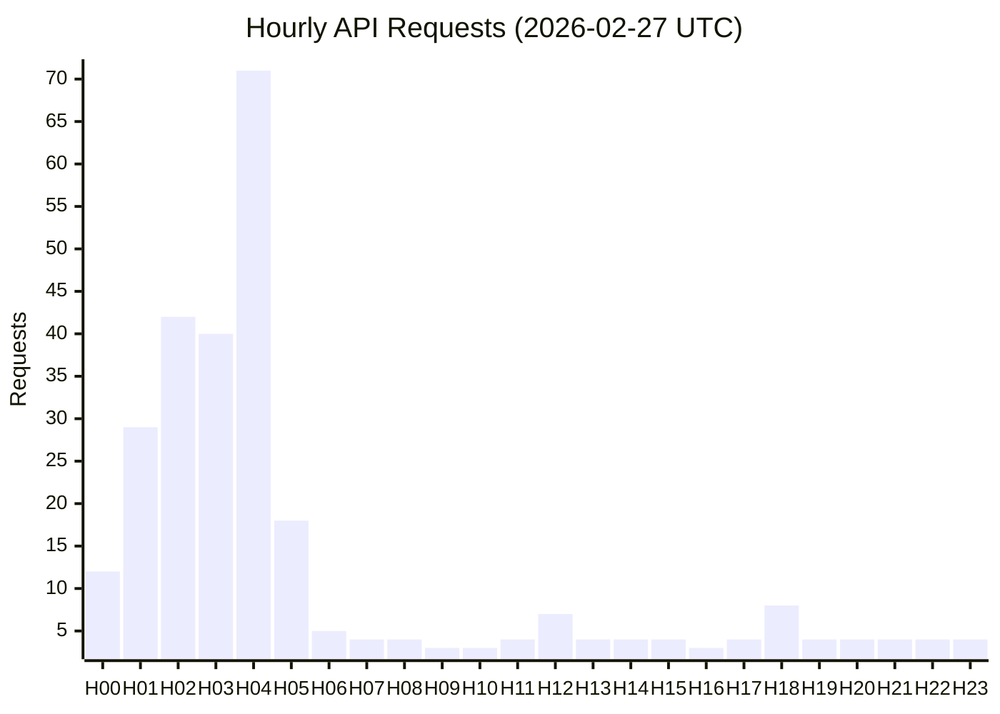

# Gemini LLM Usage Report - 2026-02-28

## Daily Overview

This report provides an overview of the Gemini LLM API usage for the Gorman Technology project, as of 2026-02-28.

## Usage Data Summary

| Metric                                       | Value       | Date       |
| :------------------------------------------- | :---------- | :--------- |
| Paid Tier Generate Content Input Tokens      | 71,239,116  | 2026-02-27 |
| Total API Requests (2026-02-28 UTC, partial) | 93         | 2026-02-28 |
| Total API Requests (2026-02-27 UTC)        | 289         | 2026-02-27 |

## Hourly API Requests (Last 24 Hours)

